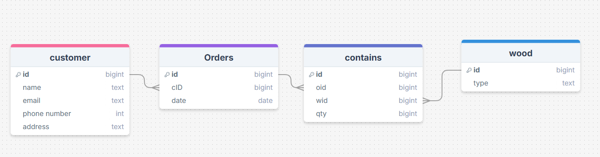

# Sprint 1 - A Working UI Prototype

## Sprint Goals

Develop a prototype that simulates the key functionality of the system, then test and refine it so that it can serve as the model for the next phase of development in Sprint 2.

[Figma](https://www.figma.com/) is used to develop the prototype.

---

## Initial Database Design

This is my initial database design, linking the customer and it's data, to it's order, too what each order contains, and which woods are in each order. 

I showed this to my end user, and the end user said this looked good. 

---

## UI 'Prototype'

The first stage of prototyping was to explore how the UI might 'flow' between states, based on the required functionality.

This Figma demo shows the initial design for the UI 'flow':

<iframe style="border: 1px solid rgba(0, 0, 0, 0.1);" width="800" height="450" src="https://embed.figma.com/design/dSYEgeYm3HbyiUYzn8DSuU/Untitled?node-id=0-1&embed-host=share" allowfullscreen></iframe>

### Testing

I gave this demo to potential end users to see if they had any comments/feedback. These issues were raised. 

> There is no way to see all wood from home. 

> There is no summary of the types of wood sold

> There is no way to search for wood/customers. 

### Changes / Improvements

After my feedback from the end user, I added a 'see wood' button, a search bar at the top, and a pie chart to the wood page. 

<iframe style="border: 1px solid rgba(0, 0, 0, 0.1);" width="800" height="450" src="https://embed.figma.com/design/AzaaLIBu6Ym8BuGRKtaqjH/Untitled--Copy-?node-id=0-1&embed-host=share" allowfullscreen></iframe>

After this demo, I went back to my end user and asked for more feedback.
> There is no way to see the Total fields

> There is no way to see the date the customer ordered. 

> The pie chart needs more information

I added the amount of wood sold to the pi chart, another wood type to better demonstrate, a people who ordered column to the wood page, and added a date column to the customers list. 

<iframe style="border: 1px solid rgba(0, 0, 0, 0.1);" width="800" height="450" src="https://embed.figma.com/design/JKcLpcsrvzZRWVojkxSdbP/Third-Draft?node-id=0-1&embed-host=share" allowfullscreen></iframe>

The next feedback from the end user was 

> There needs to be an orders page form

> There is no need for a pi chart on the customers page

> There is no need for a page for individual wood. 

<iframe style="border: 1px solid rgba(0, 0, 0, 0.1);" width="800" height="450" src="https://embed.figma.com/design/wi6YB8CYlfreT2zdBejfmF/Fourth-draft?node-id=0-1&embed-host=share" allowfullscreen></iframe>

I brought that design back to the end user, and the end user agreed with the design. 

---

## Refined UI Prototype

Having established the layout of the UI screens, the prototype was refined visually, in terms of colour, fonts, etc.

### Colours
I explored some colour palettes that I thought would work well. I used the Realtime Colors website:

- [Palette 1](https://www.realtimecolors.com/dashboard?colors=130707-fefbfb-501d00-eba961-923a0b&fonts=Inter)

- [Palette 2](https://www.realtimecolors.com/dashboard?colors=130707-fefbfb-91441d-e8a45c-963c41&fonts=Inter)

- [Palette 3](https://www.realtimecolors.com/dashboard?colors=0b0f0a-f5faf5-337428-73bc66-364c32&fonts=Inter)

### Testing

All of these palettes worked okay contrast wise, so I asked my end users which one they preferred. 

The end user decided the red and brown scheme, palette 2, was too much. 
The feedback given on the other two palettes was to increase the contrast. 

- [Increased contrast palette 1](https://www.realtimecolors.com/dashboard?colors=130707-fefbfb-501d00-ca9f71-ce8761&fonts=Inter-Inter)

- [Increased contrast palette 3](https://www.realtimecolors.com/dashboard?colors=0b0f0a-f5faf5-89d47c-87b180-364c32&fonts=Inter-Inter)

The end user decided to go with the soft brown, palette 1. 

This Figma demo shows the UI with refinements applied:

<iframe style="border: 1px solid rgba(0, 0, 0, 0.1);" width="800" height="450" src="https://embed.figma.com/design/aHXEVqepdViYgIhESoQPeP/Refined-version-1?node-id=1-10&embed-host=share" allowfullscreen></iframe>

### Testing

I gave this design to my end user, and the end user agreed.

### Changes / Improvements

No changes were needed. 

---

## Sprint Review

This sprint allowed us to create an accurate demonstration on how the website will look and feel based on user feedack. It helped refine ideas on how the project wll be made and functionality. 

