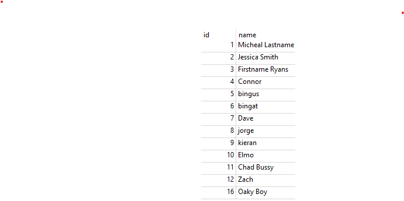
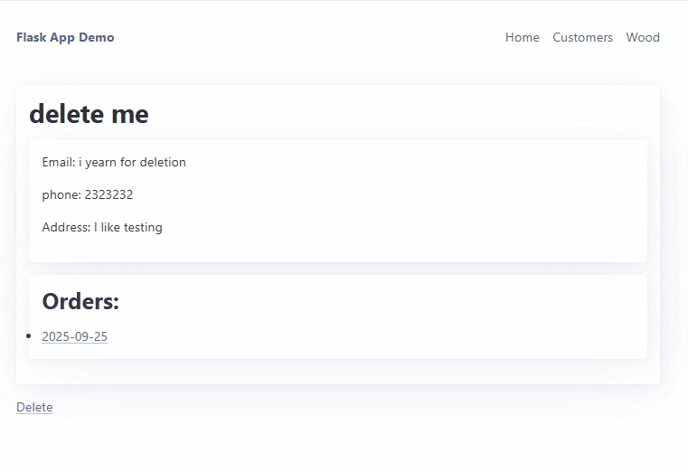

# Sprint 2 - A Minimum Viable Product (MVP)

## Sprint Goals

Develop a bare-bones, working web application that provides the key functionality of the system, then test and refine it so that it can serve as the basis for the final phase of development in Sprint 3.

---

## Implemented Database Schema

The implimented Database scheme stayed relatively similar to the original database design. However, I removed the ID key from contains, and created a join Primary key instead. 

---

## Initial Implementation

- Shows all customers and their orders from the database

- Be able to add customers to the database

- Summarises the wood orders from previous years with a Pi chart

- Search for customers in the list of customers

- Removes customers from the database

**PLACE SCREENSHOTS AND/OR ANIMATED GIFS OF THE SYSTEM HERE**

---

## Testing showing a list of customers from the database

Testing that the database will show a list of all the customers names in the database. 

List of names in the database:

List of names on the customers page on the website:

### Changes / Improvements

I decided it would be more efficiant to order the customers by their name alphabetically, rather than by how long they've been in the database. 

---

## Testing adding customers to the database

I am testing the page to add customers to the database. 

List of customers before I added any: 

Adding:

After:

### Changes / Improvements

No changes were necesary. 

---

## Testing the summary of previous orders

Testing the amount and types of wood sold from previous years getting summarised with a chart on the wood page. 

Some of the quanitities and the wood they belong to in the contains table.

The wood type the ID  corresponds to:

### Changes / Improvements

No changes were necesary. 

---

## Testing searching for customers in the customers list

In the customers table, I am testing the search bar to help the user find certain customers without scrolling. 

### Changes / Improvements

No changes were necesary. 

---

## End User Feedback

I showed this design to my end user, and the feedback given was

> We need a confirmination screen before a customer was deleted.

After showing this to my end-user they saidto change the feedback given after a customer was deleted, to show their name.

Before Changing:

After Changing:

I showed this to the end-user again, in which they said the prototype was working as intended. 

## Testing removing customers from the database

Testing to make sure, when the remove button is pressed, the customer gets removed from the database.

Database before he was removed

Removing him:

Database after:

---

## Sprint Review

Functionality with adding customers was a struggle, but once it was working the rest of the sprint went smoothly. Linking the tables in the form was difficult 

