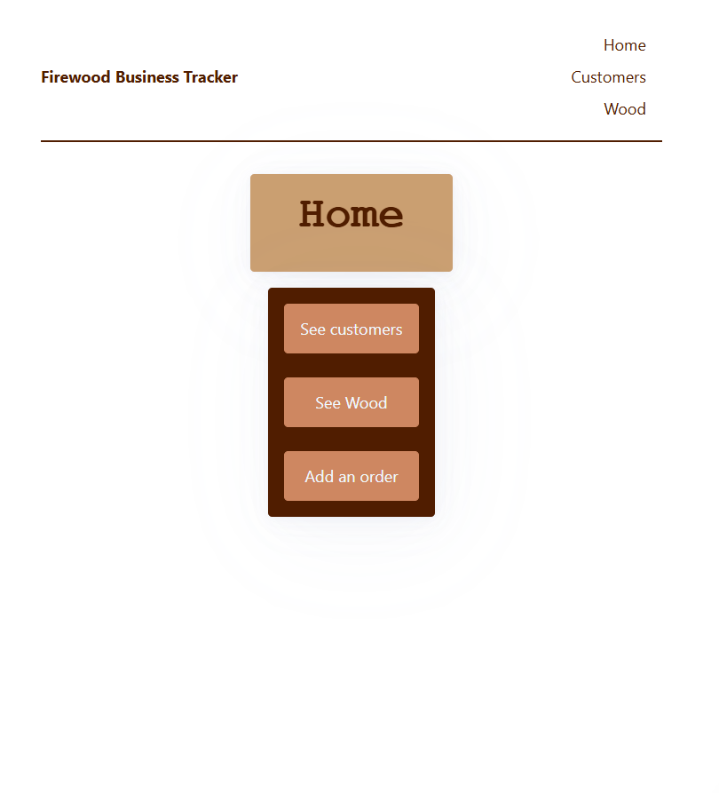
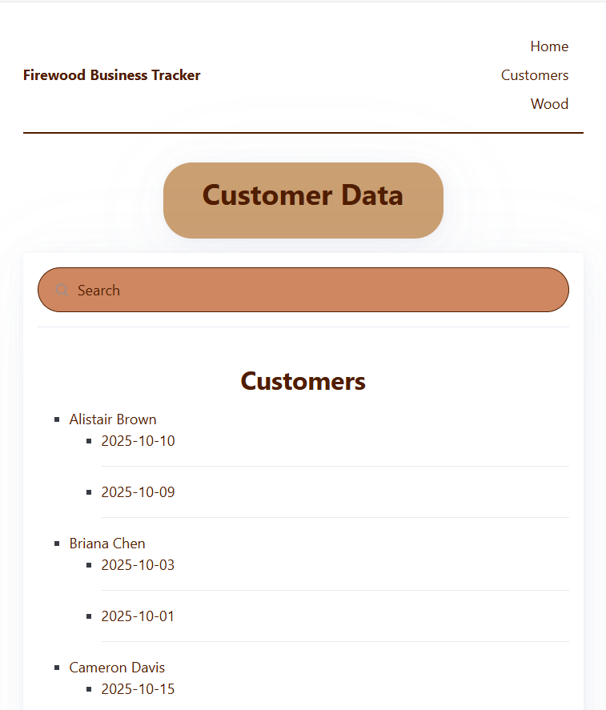
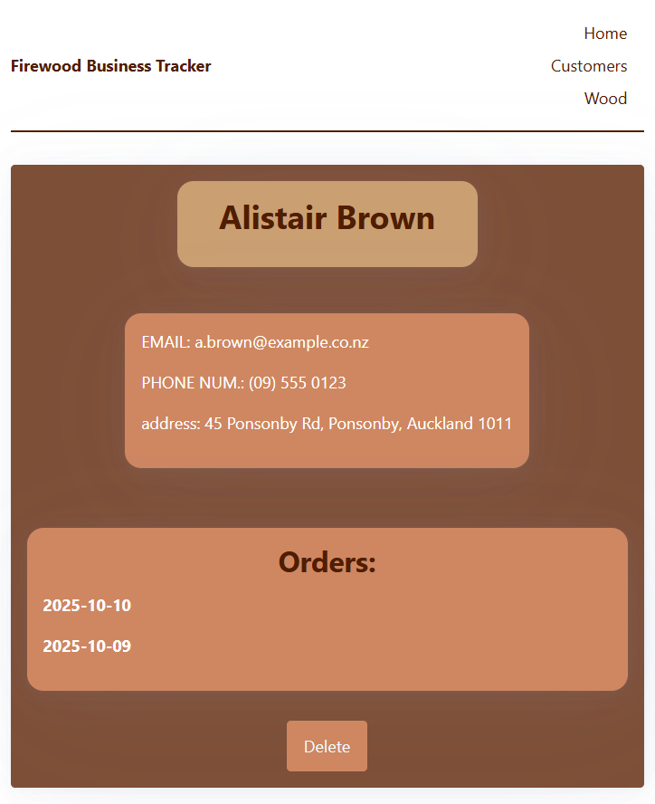
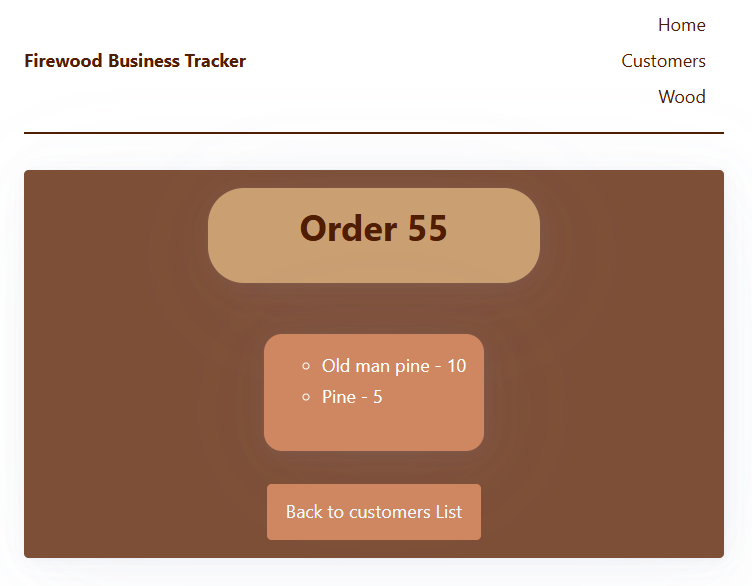
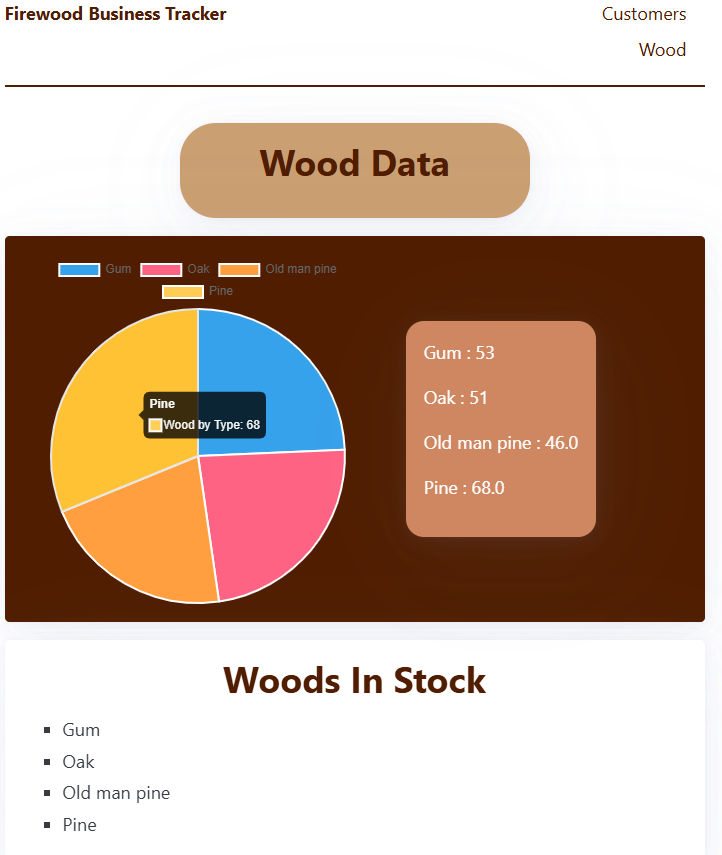
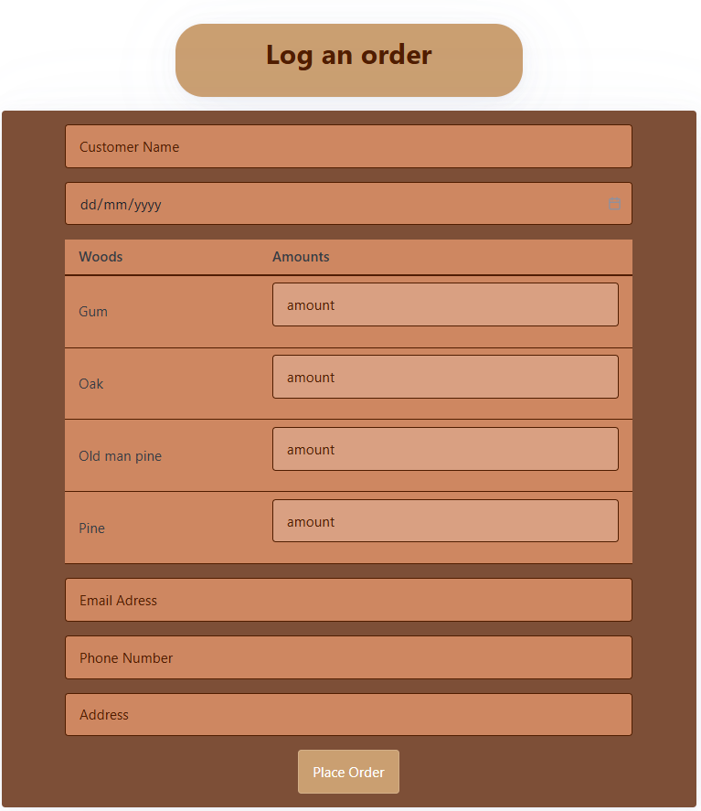
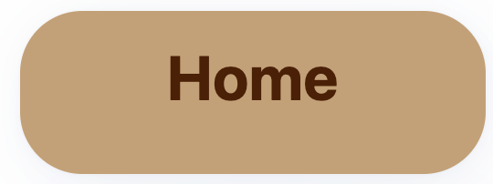
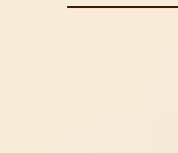

# Sprint 3 - A Refined and Complete System

## Sprint Goals

Develop the system until it is fully featured, with a refined UI and it satisfies the requirements. The system will be fully tested at this point.

---

## Updated Database Schema (if it changed)

The database schema has not changed since the previous stage of development. 

---

## Final Implementation

The web app is fully implemented with a refined UI:

---

## Testing home page design with the end user. 

Showing the website to the end user, their feedback was 

> The colour scheme fits the design of the business well. 

> I don't like the title font on the home page. 

### Changes / Improvements

I changed the font to be consistant with the rest of the page. 

Title before the font was changed

Title after the font was changed

---

## Showing the website to the end user

After showing the website to the end user, their feedback was 

> Change the background colour to be a light brown to match the rest of the website's aesthetic. 

### Changes / Improvements

I showed this design to the end user, who said the website looked great. 

## Sprint Review

This sprint went smoothly, and CSS was effectivelt implemented into the website system to create a more customised and friendly experience for our end user.
